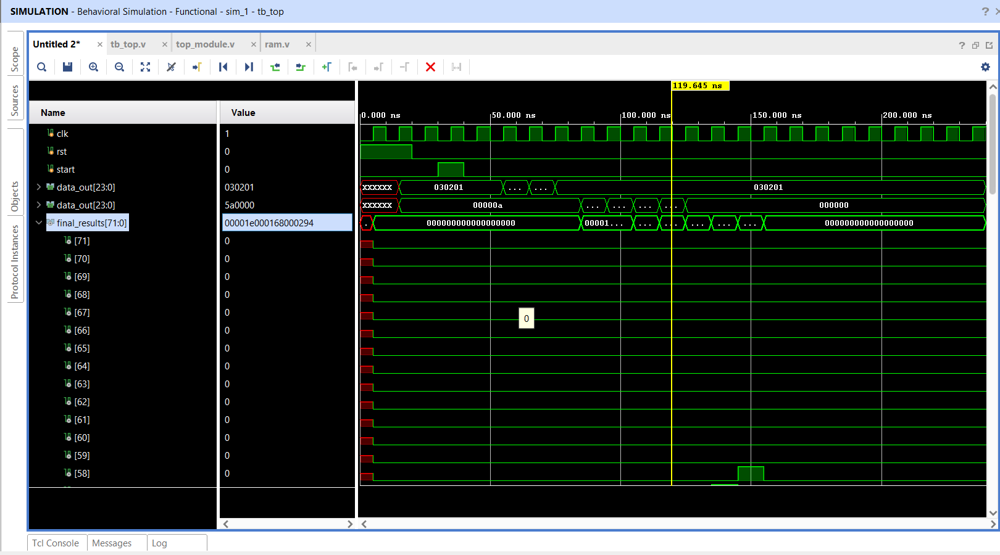

# SRAM-Integrated 3x3 Systolic Array for Matrix Multiplication


---

## 1. Project Overview

This project implements a **Weight-Stationary Systolic Array** integrated with an **SRAM-based Memory Controller**. Unlike basic simulations that force-feed data via a testbench, this design mimics a real hardware accelerator (similar to a TPU), where a controller autonomously fetches weights and input vectors from memory to perform matrix multiplication.

### Key Features

* **3×3 Systolic Core**: A pipelined grid of Processing Elements (PEs).
* **SRAM Integration**: Two independent memory banks (Weights RAM & Input RAM) simulated using `.mem` files.
* **FSM Controller**: A Finite State Machine that handles scheduling of weight loading and data streaming automatically.
* **Zero-Overhead Logic**: Uses `$readmemh` for efficient memory initialization during simulation.

---

## 2. System Architecture

The design is hierarchical. The `top_module.v` wrapper acts as the **chip**, containing the memories, the controller, and the compute core.

### Block Diagram (Logical View)

```
[ Top System (The Chip) ]
        |
        +--- [ Weight RAM ] ---> Data Bus --+
        |                                   |
        +--- [ Input RAM ] ---> Data Bus --+---> [ FSM Controller ]
                                            |
                                            v
                                [ Compute Core (3×3 Array) ]
                                            |
                                         72-bit Bus
                                            |
                                            v
                                      [ Output Result ]
```

### 3×3 Systolic Grid Structure

* **Inputs** flow from **West → East**
* **Partial Sums** flow from **North → South**

```
(PS=0)          (PS=0)          (PS=0)
  |               |               |
+-------+       +-------+       +-------+
|PE(0,0)| ----> |PE(0,1)| ----> |PE(0,2)|
| W00   |       | W01   |       | W02   |
+-------+       +-------+       +-------+
  |               |               |
+-------+       +-------+       +-------+
|PE(1,0)| ----> |PE(1,1)| ----> |PE(1,2)|
| W10   |       | W11   |       | W12   |
+-------+       +-------+       +-------+
  |               |               |
+-------+       +-------+       +-------+
|PE(2,0)| ----> |PE(2,1)| ----> |PE(2,2)|
| W20   |       | W21   |       | W22   |
+-------+       +-------+       +-------+

 Col 0 Result     Col 1 Result     Col 2 Result
```

---

## 3. Memory & Data Formatting

Two text files simulate the contents of SRAM:

* `weights.mem`
* `inputs.mem`

The FSM reads these files row-by-row.

### 3.1 Weight Memory (`weights.mem`)

* Weights are **stationary** inside the array.
* To align hardware output with standard mathematical notation (Row × Column), the **weight matrix is transposed** in memory.

**Format**:

* Hexadecimal packed as `{Col2, Col1, Col0}`

**Example**:
To perform `A × B`, the columns of matrix **A** are packed into the rows of memory.

### 3.2 Input Memory (`inputs.mem`)

The input matrix **B** is streamed through the array. Since the array is systolic, inputs must be **skewed (delayed)**:

* **Row 0** enters at `T = 0`
* **Row 1** enters at `T = 1`
* **Row 2** enters at `T = 2`

This skewing ensures each input meets the correct weight at the correct clock cycle.

---

## 4. Analyzing the Output (The “Garbage” Values)

During simulation, the output bus does not immediately show valid results for all columns due to **pipeline latency**.

Because inputs arrive diagonally, outputs also emerge diagonally.

| Cycle | Col 0       | Col 1       | Col 2       | Bus (Hex)      | Explanation            |
| ----- | ----------- | ----------- | ----------- | -------------- | ---------------------- |
| T     | Valid (300) | Garbage     | Garbage     | `...12C...XX`  | Only Column 0 complete |
| T+1   | Valid       | Valid (360) | Garbage     | `...168...294` | Column 1 completes     |
| T+2   | Valid       | Valid       | Valid (420) | `...1A4...XXX` | Column 2 completes     |

### Why “Garbage” Appears

The so-called *garbage values* are actually **partial sums**.

* Example: Column 1 may show `14` (20 decimal) because it has computed `10 × 2` but has not accumulated all terms yet.
* These values represent the array actively computing.

**Correction**:
By correctly formatting `inputs.mem` (padding zeros or aligning skew), valid outputs appear cleanly and match manual calculation.

### Mathematical Verification

With transposed weights in memory, the hardware computation corresponds to full 3×3 matrix multiplication:

```
A = [10 20 30]
    [40 50 60]
    [70 80 90]

B = [1  2  3]
    [4  5  6]
    [7  8  9]
```

The resulting matrix **C = A × B** is:

```
C = [ 300  360  420 ]
    [ 660  810  960 ]
    [1020 1260 1500 ]
```

**Observed (Hex)**:

* Row 0: `00012C` (300), `000168` (360), `0001A4` (420)
* Row 1: `000294` (660), `00032A` (810), `0003C0` (960)
* Row 2: `0003FC` (1020), `0004EC` (1260), `0005DC` (1500)

**Status**: ✅ verified



---

### The Output Log (Diagonal Wavefront)

| Cycle | Output Bus (Hex)     | Col 2            | Col 1            | Col 0 [23:0]     | Explanation                                                  |
| ----- | -------------------- | ---------------- | ---------------- | ---------------- | ------------------------------------------------------------ |
| T     | `...XX...XX...12C`   | Garbage Value    | Garbage Value    | **300 (Valid)**  | Row 0 output. Only Column 0 is finished.                     |
| T+1   | `...XX...168...294`  | Garbage Value    | **360 (Valid)**  | **660 (Valid)**  | Row 1 output. Column 0 is on Row 1. Column 1 finishes Row 0. |
| T+2   | `...1A4...32A...3FC` | **420 (Valid)**  | **810 (Valid)**  | **1020 (Valid)** | Row 2 output. All columns valid. Column 2 finishes Row 0.    |
| T+3   | `...3C0...4EC...XXX` | **960 (Valid)**  | **1260 (Valid)** | Garbage Value    | Tail output. Column 0 done. Columns 1 & 2 finish Rows 1 & 2. |
| T+4   | `...5DC...XXX...XXX` | **1500 (Valid)** | Garbage Value    | Garbage Value    | Final output. Column 2 finishes Row 2.                       |

#### Why the "Garbage" Values Are Not Random

The so-called *garbage values* are **not random noise**—they are **intermediate partial sums** produced by the systolic pipeline while computation is still in progress.

* In **Cycle T**, Column 1 outputs only the top-row computation:

  $$10 	imes 2 = 20$$

* At this point, the middle and bottom row products have **not yet arrived**, so the value is incomplete.

* Since a valid matrix-multiplication result requires the **sum of all three row products**, this intermediate value is marked as *Garbage* or *Invalid*.

These values represent the array actively accumulating results—the machine is literally **thinking**.

---

## Implementation & Performance Metrics

| Metric              | Value                            | Description                                 |
| ------------------- | -------------------------------- | ------------------------------------------- |
| Target Device       | Xilinx Artix-7 (xc7a35tcpg236-1) | Standard FPGA used on Basys3 boards         |
| Operating Frequency | 100 MHz                          | System clock (10 ns period)                 |
| Precision           | 8-bit Integer (INT8)             | Inputs and weights (standard for inference) |
| Accumulator Width   | 24-bit Integer                   | Prevents overflow during summation          |
| Peak Throughput     | 1.8 GOPS                         | 9 PEs × 2 ops/PE × 100 MHz                  |

---

## Power Consumption (Active @ 100 MHz)

| Power Component         | Value       | Explanation                                                               |
| ----------------------- | ----------- | ------------------------------------------------------------------------- |
| Dynamic Power           | ~1.1 W      | Energy used for computation and data movement                             |
| ├─ Logic / DSP          | 0.4 W       | Power consumed by the PEs performing math                                 |
| ├─ Signals / Routing    | 0.7 W       | Power consumed moving data through the interconnect (the *systolic* cost) |
| Static Power            | 0.068 W     | Leakage power (device standby)                                            |
| **Total On-Chip Power** | **~1.17 W** | Excluding I/O power, which varies by board connection                     |

## How to Run (Simulation Guide)

### 1. Vivado Project Setup

1. Open **Xilinx Vivado**.
2. Create a **new RTL project**.
3. Select the target device:
   - **Xilinx Artix-7 (xc7a35tcpg236-1)** (Basys3 compatible)

4. Add the following **Verilog source files**:
   - `top_system.v`
   - `systolic_array.v`
   - `pe.v`
   - `mac_unit.v`
   - `ram.v`

5. Add the **testbench file**:
   - `tb_top.v`

---

### 2. Memory File Placement

The design uses SRAM-style memory initialization via `$readmemh`.

Place the following files in the Vivado simulation directory:

Required files:
- `weights.mem`
- `inputs.mem`
